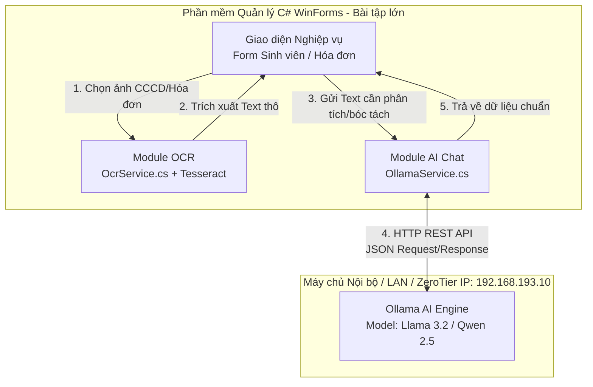

# ĐỀ XUẤT KHẢ NĂNG TÍCH HỢP VÀO PHẦN MỀM LỚN (MỤC 3.4)

Ứng dụng **AI Chat Assistant tích hợp Phân tích Đa tài liệu & OCR (Word, Excel, PDF, Markdown, Hình ảnh)** không chỉ là một ứng dụng độc lập mà còn được thiết kế dưới dạng **Module tiện ích độc lập (Micro-module)** với khả năng tái sử dụng cao (`OllamaService.cs`, `DocumentReaderService.cs`, `OcrService.cs`). 

Dưới đây là phương án và phân tích chi tiết về khả năng tích hợp module này vào các phần mềm lớn, đặc biệt là **Bài tập lớn cuối học phần (Hệ thống quản lý doanh nghiệp, trường học, y tế, kho hàng...)**.

---

## 1. Tích hợp vào những phần mềm nào?

| Loại hình phần mềm | Ví dụ hệ thống cụ thể |
| :--- | :--- |
| **Hệ thống Quản lý Trường học / Đào tạo (Edu-ERP)** | Phần mềm quản lý sinh viên, Hệ thống quản lý điểm thi, Phần mềm quản lý thư viện. |
| **Hệ thống Quản lý Doanh nghiệp (ERP / CRM / HRM)** | Phần mềm chăm sóc khách hàng (CRM), Quản lý nhân sự - tiền lương, Quản lý tài sản doanh nghiệp. |
| **Hệ thống Quản lý Kho hàng & Bán hàng (POS / Inventory)** | Phần mềm bán hàng siêu thị, Quản lý xuất nhập kho, Chuỗi cung ứng logistic. |
| **Hệ thống Quản lý Bệnh viện / Phòng khám (HIS)** | Phần mềm quản lý hồ sơ bệnh án điện tử, Quản lý toa thuốc & khám chữa bệnh. |
| **Hệ thống Quản lý Tài liệu / Văn phòng điện tử (E-Office)** | Hệ thống quản lý công văn đến/đi, Lưu trữ và số hóa hồ sơ pháp lý. |

---

## 2. Có thể tích hợp ở chức năng nào?

### 2.1. Chức năng Số hóa tự động (OCR Data Entry)
- **Quét thẻ Căn cước công dân / Thẻ sinh viên:** Thay vì nhân viên nhập tay thông tin khi tiếp nhận hồ sơ, chỉ cần chụp ảnh CCCD/Thẻ SV. `OcrService` trích xuất text, sau đó `OllamaService` phân tích và bóc tách tự động ra JSON chuẩn (`Họ tên`, `Ngày sinh`, `Số CCCD`, `Địa chỉ`) để tự động điền vào Form nhập liệu.
- **Quét hóa đơn / Biên lai thanh toán:** Tự động đọc tổng tiền, ngày tháng, mã số thuế từ ảnh chụp hóa đơn giấy để đưa vào phần mềm kế toán hoặc nhập kho.
- **Nhập liệu bảng điểm / Toa thuốc giấy:** Đọc nội dung từ tài liệu viết tay hoặc bản in cũ và chuyển thành dữ liệu bảng chuẩn trong hệ thống.

### 2.2. Chức năng Trợ lý thông minh (AI Copilot / Chatbot Hỗ trợ)
- **Chatbot hỗ trợ nghiệp vụ 24/7 cho nhân viên:** Tích hợp một khung Chat rút gọn (Dock ở góc phải màn hình phần mềm chính). Khi nhân viên gặp khó khăn về quy trình sử dụng phần mềm hoặc tra cứu chính sách công ty, có thể hỏi trực tiếp AI ngay trên giao diện C# WinForms mà không cần mở trình duyệt.
- **Hỗ trợ hỏi đáp cho Khách hàng / Sinh viên:** Tự động trả lời các câu hỏi thường gặp (FAQ) về lịch thi, học phí, giờ làm việc, chính sách bảo hành...

### 2.3. Chức năng Phân tích, Tóm tắt và Soạn thảo văn bản (AI Summary & Generation)
- **Tóm tắt hồ sơ dài:** Khi người dùng mở một biên bản họp, hợp đồng dịch vụ hoặc bệnh án dài hàng chục trang, chức năng AI có thể tóm tắt nhanh các ý chính chỉ trong vài giây.
- **Tự động soạn email / công văn:** Giúp nhân viên hành chính tự động soạn thảo email phản hồi khách hàng hoặc báo cáo công việc hàng tuần dựa trên từ khóa gợi ý.

---

## 3. Giá trị và lợi ích mang lại khi tích hợp

### 3.1. Về mặt Nghiệp vụ & Hiệu suất làm việc
- **Tiết kiệm tới 80% thời gian nhập liệu:** Giảm thiểu thao tác gõ bàn phím thủ công cho người dùng nhờ bóc tách thông tin tự động từ hình ảnh.
- **Giảm sai sót của con người (Human Error):** Tránh các lỗi gõ nhầm số CCCD, nhầm số tiền hóa đơn hay sai chính tả trong quá trình xử lý hồ sơ lớn.
- **Nâng cao trải nghiệm người dùng (UX):** Biến phần mềm quản lý khô khan truyền thống thành một hệ thống thông minh, có khả năng "hiểu" và tương tác bằng ngôn ngữ tự nhiên.

### 3.2. Về mặt Kỹ thuật & Bảo mật
- **100% Bảo mật dữ liệu nội bộ (On-Premise Privacy):** Do sử dụng **Ollama LLM tự lưu trữ trên máy chủ riêng (như mô hình hiện tại chạy qua mạng LAN/ZeroTier)** và **Tesseract OCR chạy offline ngay trên client/server**, toàn bộ dữ liệu hình ảnh, hóa đơn, hồ sơ cá nhân **KHÔNG BẠO GIỜ** bị gửi lên các máy chủ cloud bên thứ 3 (như OpenAI hay Google). Đây là yếu tố sống còn với các phần mềm ngân hàng, y tế và hành chính công.
- **Chi phí vận hành bằng 0 (Zero API Cost):** Không tốn chi phí thuê bao hàng tháng hay trả tiền theo token cho API của bên thứ 3.
- **Kiến trúc Module hóa, dễ dàng tích hợp:** Các lớp `OllamaService` và `OcrService` hoàn toàn tách biệt với giao diện, có thể sao chép trực tiếp vào bất kỳ project C# WinForms / WPF / ASP.NET nào và sử dụng ngay chỉ với vài dòng code `async/await`.

---

## 4. Sơ đồ kiến trúc tích hợp gợi ý cho Bài tập lớn

